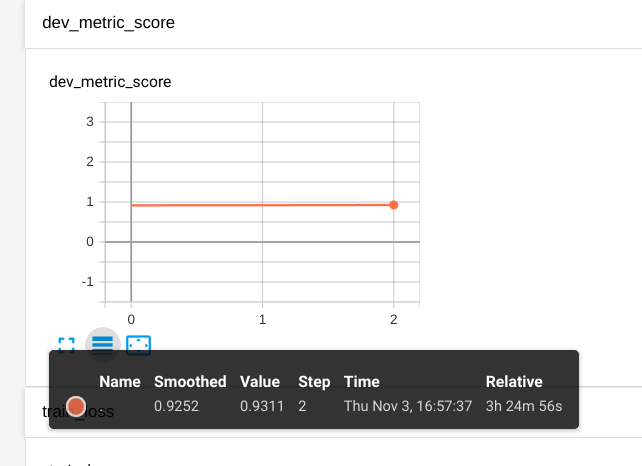
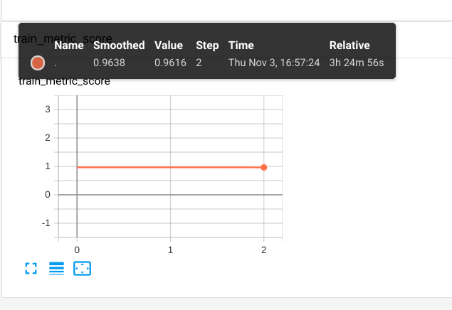

## 说明

这个是单塔模型对于判断句子对相似度的尝试。

相比于pointwise：
pointwise是判断句子对的相似度，如果大于阈值（比如0.5），则认为这两个句子相一致。
而pairwise，可以返回句子对的相似度score并应用于下层模型。

## 对于使用[AUC](https://www.zhihu.com/question/39840928)

1. TPRate的意义是所有真实类别为1的样本中，预测类别为1的比例。
2. FPRate的意义是所有真实类别为0的样本中，预测类别为1的比例。

希望：对于真实类别为1的样本，分类器预测为1的概率（即TPRate），要大于真实类别为0而预测类别为1的概率（即FPRate）。

那么借鉴《美团机器学习实践》中AUC的一句话总结：**AUC取值越大说明模型越可能将正样本排在负样本的前面。**

AUC计算主要与排序有关，所以它对排序敏感，而对预测分数没有那么敏感。

## 运行
1. python generate_negative_data.py（以train.jsonl增加负样本，扩大训练数据集）
2. python trainer.py

## 结果

我跑了三个epoch，结果如下：
|dev                 |   train         |
|-----------------------|---------------|
|   | |


测试句子可看predict.py
```python
samples = [
    {"query": "我长的帅不帅", "title": "我长的就问帅不帅", "label": 0},  # label是假的哦，这里省事了～
    {"query": "嚼口香糖能减肥吗", "title": "嚼口香糖会减肥吗？", "label": 0},

    {"query": "孕妇能用护肤品吗", "title": "哪些护肤品孕妇能用？", "label": 0},
    {"query": "桂林山水在哪个省", "title": "桂林山水在哪个市", "label": 0},
    {"query": "动物园好玩么", "title": "这个时候去动物园好玩吗", "label": 0},
    {"query": "肆虐是什么意思？", "title": "肆虐的肆是什么意思", "label": 0}

]
infer = PairWiseMatchInfer()
output = infer.infer(datas=samples)
print(output)
# array([[0.94228584],
#        [0.90933144],
#        [0.748481  ],
#        [0.34310436],
#        [0.8954417 ],
#        [0.33769682]], dtype=float32)
```